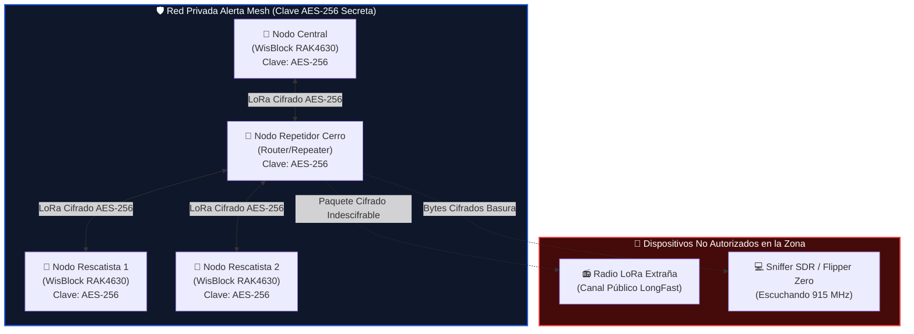

# Guía Exhaustiva: Arquitectura de Red LoRa Mesh Privada, Cifrada y de Acceso Restringido

Esta guía detalla paso a paso cómo diseñar, desplegar y operar una red de nodos **Meshtastic / LoRa privada**, completamente **cifrada de extremo a extremo** con **AES-256**, inmune a la escucha de terceros (eavesdropping) y blindada contra la inyección o suplantación de mensajes no autorizados.

---

## 1. Fundamentos de Seguridad y Cifrado en Meshtastic

### ¿Por qué la configuración por defecto es pública?
De fábrica, todos los nodos Meshtastic utilizan el canal primario `LongFast` con una clave precompartida (PSK) fija y pública (`AQ==`, correspondiente a la clave `1`). Esto significa que **cualquier persona** con un dispositivo LoRa en la misma frecuencia (por ejemplo, 915 MHz) puede recibir, leer y emitir mensajes en ese canal.

### ¿Cómo funciona el cifrado criptográfico en la malla?
Meshtastic implementa dos niveles de cifrado:

```
+-------------------------------------------------------------------------+
|                              MeshPacket                                 |
|                                                                         |
|  [Encabezado Público en Claro]                                           |
|  - from: NodeNum (4 bytes)                                              |
|  - to: Broadcast / NodeNum (4 bytes)                                    |
|  - channel: ChannelIndex (1 byte)                                       |
|  - id / hop_limit / rx_time / want_ack                                  |
|                                                                         |
|  [Payload Criptográfico Cifrado con AES-256-CTR]                        |
|  +-------------------------------------------------------------------+  |
|  |  Texto del Mensaje / Coordenadas GPS / Telemetría / Alertas SOS   |  |
|  |  Firmado digitalmente con Curve25519 / Ed25519 (PKI)               |  |
|  +-------------------------------------------------------------------+  |
+-------------------------------------------------------------------------+
```

1. **Cifrado Simétrico por Canal (AES-128 / AES-256 CTR):**
   - Cada canal posee su propia **clave precompartida (PSK)** de 256 bits (32 bytes).
   - El payload (texto, ubicación GPS, telemetría de sensores, mensajes de emergencia) se cifra **antes** de enviarse al transmisor LoRa.
   - Si un nodo extraño captura el paquete por el aire, solo ve bytes pseudoaleatorios indescifrables.

2. **Infraestructura de Clave Pública (PKI / Curve25519 & Ed25519):**
   - Cada nodo genera un par de claves asimétricas únicas (Pública y Privada).
   - Los mensajes directos (DM Punto a Punto) se cifran mediante **ECDH (Elliptic-curve Diffie–Hellman)** + AES-256.
   - Las firmas criptográficas aseguran que ningún atacante pueda suplantar el nombre ni la identidad de otro nodo.

---

## 2. Diagrama de Aislamiento y Seguridad de la Red



---

## 3. Generación de Claves Criptográficas AES-256 Fuertes

Para garantizar máxima seguridad, la clave del canal **nunca** debe ser una palabra común, sino 32 bytes criptográficamente aleatorios (256 bits).

### Método 1: Generar clave con OpenSSL en Linux / macOS / WSL
Ejecuta en tu terminal:
```bash
openssl rand -base64 32
```
*Ejemplo de salida:*
```
k9vF8mQ1vT6nZ4wY7aK2eP0sL9bX3vM5rT8yU1iO4pA=
```

### Método 2: Generar clave con Python
```python
import secrets
import base64

key_bytes = secrets.token_bytes(32)
psk_base64 = base64.b64encode(key_bytes).decode('utf-8')
print(f"Clave AES-256 para Canal Mesh: {psk_base64}")
```

> [!IMPORTANT]
> Guarda esta clave en un lugar seguro (por ejemplo, tu gestor de contraseñas). **Cualquier nodo que tenga esta clave formará parte de tu red; quien no la tenga, estará 100% excluido.**

---

## 4. Configuración Práctica Paso a Paso

### Paso 1: Configurar el Canal Primario Privado
Se debe reemplazar el canal `0` (Primary) por un canal con nombre propio y la clave AES-256 generada:

#### Vía Meshtastic CLI (Herramienta Oficial por USB):
```bash
# 1. Conectar el nodo por USB
# 2. Configurar el nombre del canal y la clave AES-256
meshtastic --ch-set name "AlertaMeshPrivada" --ch-index 0
meshtastic --ch-set psk "k9vF8mQ1vT6nZ4wY7aK2eP0sL9bX3vM5rT8yU1iO4pA=" --ch-index 0

# 3. Asignar preset de módem (ej: MediumFast para equilibrio alcance/velocidad)
meshtastic --set lora.modem_preset MEDIUM_FAST
```

---

### Paso 2: Aislamiento en la Capa de Radiofrecuencia (Frecuencia Custom)

Además del cifrado criptográfico, puedes aislar físicamente tus transmisiones cambiando la frecuencia base o el sub-canal LoRa:

1. **Definir `channel_num` / Frecuencia específica:**
   ```bash
   # Configurar una ranura de frecuencia no estándar
   meshtastic --set lora.channel_num 42
   ```
2. **Definir región correcta:**
   - Chile / Latinoamérica: `US915` (915.0 MHz - 928.0 MHz).

---

### Paso 3: Proteger la Gestión Administrativa del Nodo (Bloqueo Físico y BLE)

Para evitar que un tercero se acerque al nodo físico con su celular, se conecte por Bluetooth y extraiga las claves o reconfigure el nodo:

1. **Establecer una Clave de Administrador (`admin_key`):**
   ```bash
   # Generar clave de admin
   openssl rand -base64 32
   
   # Asignarla al nodo
   meshtastic --set security.admin_key "CLAVE_ADMIN_AQUI"
   ```
2. **Establecer PIN fijo de emparejamiento Bluetooth:**
   ```bash
   meshtastic --set bluetooth.fixed_pin 849201
   meshtastic --set bluetooth.mode FIXED_PIN
   ```
3. **Desactivar Bluetooth en nodos repetidores en torres (Solo LoRa):**
   ```bash
   meshtastic --set bluetooth.enabled false
   ```

---

## 5. Distribución Segura de la Red a Nuevos Nodos

Para incorporar nuevos teléfonos y antenas a tu red privada sin enviar claves en texto plano:

1. **Código QR Cifrado / URL de Canal:**
   - La configuración completa del canal (Nombre + Frecuencia + PSK AES-256) se empaqueta en una URL del tipo:
     `meshtastic://channel#<Base64_Config_Data>`
   - Este código QR se genera una sola vez y se escanea directamente en taller con los teléfonos autorizados.

2. **Roles de los Nodos en la Red:**
   - **`CLIENT`**: Nodos que llevan los usuarios con la app móvil.
   - **`ROUTER_CLIENT`**: Nodos estratégicos con buena antena (techo de cuartel, vehículo de mando).
   - **`REPEATER`**: Nodos solares en cerros o puntos altos. No guardan mensajes de texto en memoria ni requieren teléfono; solo retransmiten ráfagas LoRa cifradas a gran distancia.

---

## 6. ¿Qué ocurre si un intruso intenta atacar la red?

| Tipo de Ataque | ¿Cómo actúa el atacante? | Resultado en nuestra Red Privada |
| :--- | :--- | :--- |
| **Escucha Pasiva (Sniffing)** | Escucha la frecuencia con una radio LoRa o SDR. | ❌ **Fracasa**: El payload está cifrado con AES-256. Solo ve ruido aleatorio. |
| **Inyección de Mensajes Falsos** | Transmite texto o alertas falsas en la frecuencia. | ❌ **Fracasa**: Al no tener la clave AES-256, los nodos descartan los paquetes por fallo de integridad. |
| **Suplantación de Identidad (Spoofing)** | Intenta fingir que es el nodo central o un bombero. | ❌ **Fracasa**: La firma PKI Curve25519/Ed25519 invalida cualquier paquete con firma no coincidente. |
| **Ataque de Replay (Reenvío)** | Graba un paquete cifrado antiguo y lo retransmite. | ❌ **Fracasa**: Meshtastic rechaza paquetes con IDs de paquete repetidos o timestamps caducados. |

---

## 7. Resumen de Buenas Prácticas

1. **Nunca usar el canal público por defecto (`LongFast` / `AQ==`) para operaciones críticas.**
2. **Crear siempre un canal primario con clave AES-256 (`psk` de 32 bytes en Base64).**
3. **Establecer PIN fijo de Bluetooth o clave Admin en los nodos físicos.**
4. **Configurar la posición fija de antenas fijas/repetidores desde la memoria Flash con nuestra app.**
5. **Utilizar canales secundarios cifrados si se desea segmentar departamentos o brigadas (ej: Canal 1: Mando, Canal 2: Rescate, Canal 3: Logística).**
